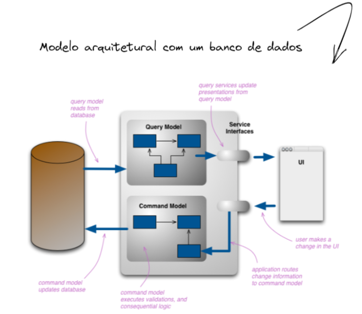

### Fontes:
As fontes que usei para basear meus estudos e esse 'artigo' foram:
- https://martinfowler.com/bliki/CQRS.html -> Martin Fowler
- https://docs.microsoft.com/pt-br/azure/architecture/patterns/cqrs -> Microsoft Docs
- https://www.youtube.com/watch?v=cw0oVKCK4iU -> Dicionario do Programador (Youtube)
- https://www.eventstore.com/cqrs-pattern#:~:text=CQRS%20is%20an%20architectural%20pattern,which%20is%20Command%20Query%20Separation.
- https://www.macoratti.net/20/08/c_cqrs1.htm -> Macoratti

# CQRS

# Contexto de Problema

Vamos pensar que temos uma aplicação num consultório medico pra fazer agendamento de consultas, e que, até o momento, somente uma pessoa usa essa aplicação. Com isso, é uma aplicação desktop, onde o banco de dados fica armazenado na própria maquina do usuário, então se você formata o pc, perdeu tudo. Como só existe um usuário, ele está realizando somente consultas e alterando registros de forma **não concorrente.**

Mas ai, o consultório evoluiu pra uma clínica, e agora temos 10 atendentes. Agora o sistema roda em Web na rede local em um servidor dentro dessa clinica, e o banco de dados também fica num servidor próprio dentro da clinica. Nessa situação, as consultas e alterações no banco começam a ter certa **concorrência.**

E agora sua clinica cresceu muito, e a sua aplicação roda em diversas clinicas e consultórios, e agora, **quem marca a consulta é o próprio cliente.** Isso gerou uma carga enorme de dados, isso gerou **muita concorrência, envolvendo processos simultâneos.**

Então temos que ter uma alternativa para tirar o gargalo que a concorrencia está causando ou irá causar. É aí que entra a ideia do CQRS.

# Entendendo o problema

Nas arquiteturas tradicionais, o mesmo modelo de dados é usado pra consultar e atualizar um banco de dados. Isso é algo até certo ponto simples, e funciona muito bem pra um CRUD, que seria uma camada ‘mais fina’ em cima do banco de dados.

Em aplicativos mais complexos, entretanto, essa abordagem pode se tornar bem complicada. Podemos executar muitas consultas diferentes no lado de leitura, retornando objetos DTOs com diferentes formas. O Mapeamento dos objetos pode acabar ficando muito grande e complicado. No lado da gravação e alteração de dados, o modelo pode implementar validações complexas e logica de negócios. Como resultado disso, podemos acabar com modelos excessivamente complexos, que fazem muitas coisas.

Geralmente, uma aplicação com muito fluxo, muita complexidade, ia ter um deadlock no banco, de tantas informações paralelas e cruzadas ao mesmo tempo sendo feitas.

Nessa ultima imagem a gente pode ver que os modelos são usados pra multiplas coisas, e esse é o ponto central do CQRS.

# Solução CQRS

CQRS significa uma **Separação das operações de Comando e Consulta.** Basicamente é um padrão **que separa as operações de leitura (query) e atualização (command) para armazenamento de dados.** A aplicação de CQRS permite ao sistema poder evoluir melhor ao longo do tempo e impede que comandos de atualização gerem conflitos de mesclagem no nível de domínio.

O CQRS separa leituras e gravações em modelos diferentes, usando comandos para atualizar dados e consultas para ler dados. **A vantagem desse pattern é que dividimos a aplicação em modelos de leitura e gravação, assim movemos a responsabilidade pra objetos dedicados, ou seja, um modelo de gravação não precisa se preocupar com um retorno de dados e o modelo de leitura pode ser especificamente escrito pra retornar os dados corretos e satisfazer os requisitos do aplicativo**

- **Os comandos e a interface do usuario são baseados em tarefas, em vez de serem centrados a dados. Ou seja, em vez de ‘definirStatusDeReserva()’ vai ser ‘ReservarQuartoDeHotel’**
    - Isso possibilita criamos uma interface de usuario baseada em tarefas, intenção.
- Os comandos podem ser colocados em uma fila pra processamento assincrono, uma vez de serem processados de forma Síncrona.
    - Os comandos jamais retornam valores, pq, se retornarem algo, quebramos a ideia central do CQRS, da separação dos modelos de leitura e gravação. **Se precisarmos que retorne, nao devemos implementar a CQRS nessa parte da nossa aplicação.**
- **As consultas nunca modificam o banco de dados. Uma consulta retorna somente um DTO que não encapsula qualquer conhecimento do domínio.**

A partir do momento em que os  dados são alterados, precisamos realizar a sincronização da base dados de leitura. **Existem diversas formas de realizar essa sincronização dos dados, são elas:**

# Um banco de dados vs bancos distintos

Podemos tanto separar fisicamente os dados de leitura de dados de gravação. Nesse caso, o banco de dados de leitura pode usar seu proprio esquema de dados, otimizado pra consultas. por exemplo, ele pode armazenar uma exibição materializada dos dados, pra evitar mapeamentos de ORM complexos ou junções complexas. Pode ainda usar um tipo diferente de armazenaento de dados.

Se bancos de leitura e gravação separados sao usados**,** seles devem ser mantidos em sincronia. **Normalmente isso é feito fazendo com que o modelo de gravação publique um evento sempre que atualizar o banco de dados. Isso ja entra no estilo de arquitetura de eventos.**

**No caso de bancos de dados de leitura e gravação distintos, não vamos poder usar migrations ou nada de comandos automaticos de ORMs ja que estamos trabalhando orientados a tarefas, ou seja, cada caso vai ser singular, e o ORM não consegue atender isso.**

# Quando usar o padrão CQRS

Devemos considerar a utilização do padrão CQRS em **domínios altamente colaborativos, onde muitos usuarios acessam os mesmos dados em paralelo. O CQRS permite que definimos comandos com granularidade suficiente pra minimizar conflitos de mesclagem no nível de domínio, e os conflitos que surgem podem ser mesclados pelo comando.**

Devemos considerar a utilização desse padrão quando as interfaces de usuario for baseadas em tarefas, onde os usuarios são guiados por um processo complexo como uma serie de etapas ou com modelos de dominio complexos. 

Devemos considerar a utilização desse padrão quando o desempenho de leituras de dados deve ser ajustado separadamente do desempenho de gravação de dados. O que quer dizer aqui é que **quando o numero de leituras for muito maior que o de escrita. Assim, nesse cas, podemos escalar o modelo de leitura, mas executar o modelo de gravação em apenas algumas instancias basicas.** 

Devemos considerar a utilização desse padrão quando uma equipe de desenvolvedores podem se concentrar somente no modelo de dominio complexo que faz parte de gravação, e outra equipe pode concentrar somente na parte de leitura

Devemos considerar a utilização desse padrão quando tivermos integração com outros sistemas, especialmente em combinação com fornecimento de eventos, onde a falha de um subsistema não afeta a disponibilidade de outros

# Quando NÃO usar o padrão CQRS

Devemos considerar a não utilização desse padrão quando o domínio ou as regras de negócio são simples 

Devemos considerar a não utilização desse padrão quando a interface de usuário da nossa aplicação for um CRUD simples, e operações de acesso a dados são insuficientes.

# A combinação do CQRS com o EventSourcing

O Padrão CQRS é frequentemente utilizado juntamente com o padrão de Fornecimento de Eventos, ou, a programação orientada a eventos. Os sistemas que são baseados em CQRS usam modelos de dados de gravação e leitura separados, cada um adaptado a tarefas relevantes e, muitas vezes, localizados em repositórios separados fisicamente. 

Quando utilizado com o padrão de eventos, o repositório de eventos é o modelo de gravação, e ele é a principal fonte oficial de informações. O Modelo de leitura do CQRS fornece exibições materializadas dos dados, geralmente como exibições altamente desnormalizadas. Essas exibições são adaptadas as interfaces do aplicativo, e isso ajuda a maximizar o processo de desempenho de consulta como exibição.

**Quando utilizarmos o CQRS combinado com o padrão de Fornecimento de Evento, temos que considerar algumas coisas:**

- Qualquer sistema onde os repositorios de gravaçã e leitura são separados, **os sistemas serão consistentes. POREM, haverá algum atraso entre o evento gerado e o armazenamento de dados sendo atualizado**
- O Padrão adiciona  certa complexidade no codigo, e ele deve ser criado para iniciar e tratar eventos, e montar ou atualizar exibições ou objetos apropriados exigidos por consultas, ou um modelo de leitura. **A complexidade da implementação de um padrão CQRS quando alinhado com padrão de eventos pode dificultar a implementação e requer uma abordagem diferentes pra concepção de sistemas.**
